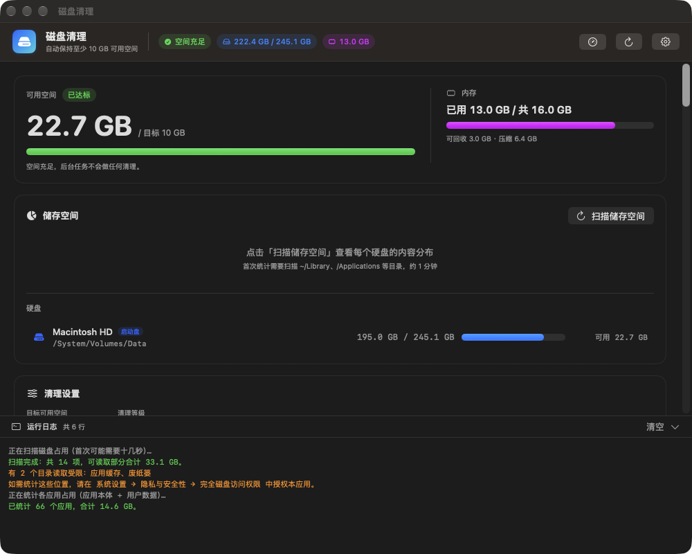
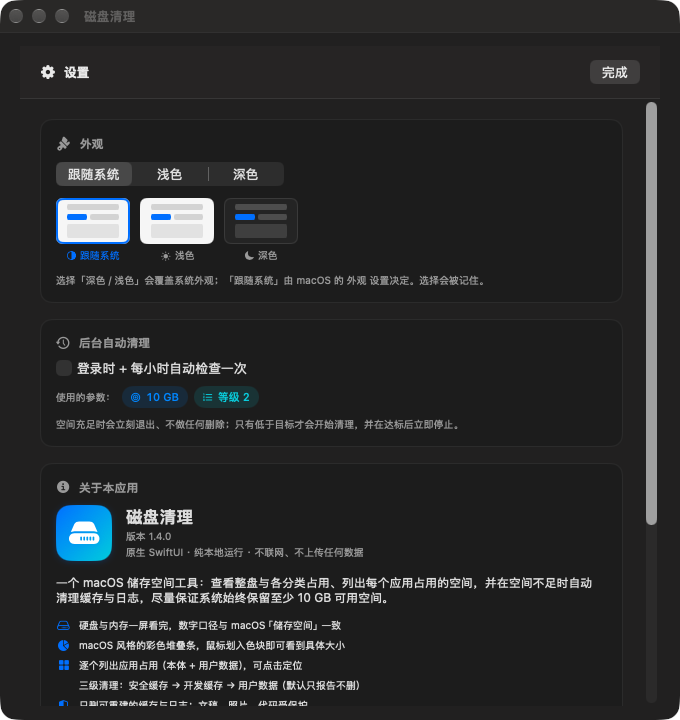

# DiskCleaner

**A native macOS storage cleaner with a GUI — keeps at least 10 GB free, automatically.**

DiskCleaner shows you where your disk space actually went (whole-disk and per-category,
macOS *Storage* style), lists how much space every app uses, and quietly cleans rebuildable
caches and logs in the background so your Mac never runs out of space.

[](#requirements)
[](https://swift.org)
[](LICENSE)
[](#download)

> **Note:** the app UI is currently in **Simplified Chinese**.
> English localization is on the [roadmap](#roadmap) — PRs are very welcome.
> 中文说明见 **[README.zh-CN.md](README.zh-CN.md)**。

---

## Screenshots

**Main window** — free space vs. target, disk & memory at a glance, macOS-style storage
breakdown with hover tooltips, and per-app usage:



**Settings** — theme (system / light / dark), auto-clean, file locations:



**About** — its own window (menu **DiskCleaner → About DiskCleaner**), with the feature
rundown, safety design and links to the repo and releases.

---

## Features

- **Never run out of space** — a background agent checks hourly and cleans only when free
  space drops below your target (default **10 GB**), then stops the moment the target is met.
  Never over-cleans.
- **Know where your space went** — a macOS-*Storage*-style stacked bar with categories
  (Applications, Documents & Desktop, Downloads, Photos, Music, Movies, Mail & Messages,
  Developer caches, App data, System & app caches, System data & other, Free).
  **Hover any segment** to see its exact size; toggle the **123** button to print the
  numbers right on the bar.
- **Per-app usage** — every app's bundle size **plus its user data**
  (`~/Library/Containers`, `~/Library/Caches`, `~/Library/Application Support`),
  sorted by size, click to reveal in Finder.
- **Per-app data manager** — click the ⚙︎ next to any app to see the folders it keeps in
  `~/Library`, split into **cache / logs** (safe, preselected) and **user data / unknown**
  (chat histories, databases, login state). The risky ones are **locked** until you flip an
  explicit "I understand" switch, and deleting them asks for confirmation again. Deletion
  still goes through the same home-whitelist + protected-path rules.
- **Correct numbers** — decimal units for storage (`245.1 GB`, exactly what macOS shows)
  and binary units for memory (`16 GB`), matching Apple's conventions.
- **Menu bar extra** — a small icon in the menu bar (with the free space next to it, if you
  like). Click it for a popover with free space, whole-disk and memory usage, plus buttons to
  open the main window, clean, or quit. The icon turns into a warning triangle when you are
  below your target.
- **Three safety tiers** — safe caches → developer caches → user data (opt-in only).
- **No dependencies** — pure SwiftUI + a POSIX shell script. No Homebrew, no Python.
  Runs on the built-in Command Line Tools.
- **Private by design** — nothing is uploaded anywhere. No network access at all.
- **Universal binary** — Apple Silicon + Intel.

---

## Install

### Download

Grab `DiskCleaner-v1.0.0-beta.3-macos-universal.zip` from
**[Releases](https://github.com/wang90/disk-cleaner/releases)** (marked *Pre-release*), unzip, and drag
`DiskCleaner.app` into `/Applications`.

The build is **ad-hoc signed** (not notarized), so the first launch shows
*"Apple could not verify DiskCleaner is free of malware"*. That is expected — see
[Gatekeeper](#gatekeeper) for the 10-second fix.

### Build from source

Requirements: macOS 14+, Xcode **Command Line Tools** (not the full Xcode).

```bash
git clone https://github.com/wang90/disk-cleaner.git
cd disk-cleaner
./build.command          # builds DiskCleaner.app (universal) and opens it
```

`build.command` only uses tools that ship with macOS:
`swiftc`, `sips`, `iconutil`, `codesign`, `lipo`.

If `swiftc` is missing:

```bash
xcode-select --install
```

---

## Usage

### GUI

Launch `DiskCleaner.app`:

| Control | What it does |
|---|---|
| **Target** | Free space to guarantee (5 / 10 / 15 / 20 / 30 / 50 GB) |
| **Tier** | 1 Safe (caches, logs) · 2 Developer caches · 3 User data |
| **Dry run** | Show what *would* be deleted without deleting (on by default) |
| **Deep clean** | Ignore "target already met" and run the selected tiers fully |
| **Purge memory** | Also run `purge` to release inactive memory |
| **Auto clean** | Install the LaunchAgent: check at login + every hour |
| **123 button** | Show/hide sizes directly on the storage bar (hover always works) |
| **Click a row** | Reveal that folder in Finder, or request permission if it is locked |
| **⚙️ Settings** | Theme (system / light / dark), auto-clean, file locations |
| **About window** | **DiskCleaner → About DiskCleaner** in the menu bar, or the button at the bottom of Settings. Opens as its own window: what it does, safety design, and links |
| **Menu bar icon** | Click it any time for a popover with free space / disk / memory, and quick actions. Configurable in Settings → 菜单栏 |

Keyboard: `⌘R` refresh · `⇧⌘R` rescan · `⌘K` clean · `⌘L` logs · `⇧⌘S` storage scan.

### Command line

The GUI is a front-end for `scripts/diskautoclean.sh`, which works on its own:

```bash
./scripts/diskautoclean.sh --status              # disk + memory overview
./scripts/diskautoclean.sh --scan                # what is taking space
./scripts/diskautoclean.sh --apps                # per-app usage (top 40)
./scripts/diskautoclean.sh --storage             # macOS-style categories
./scripts/diskautoclean.sh --volumes             # every mounted volume (JSON)
./scripts/diskautoclean.sh --dry-run --force     # preview a full clean
./scripts/diskautoclean.sh --target 20G          # keep 20 GB free
./scripts/diskautoclean.sh --quiet               # for cron / launchd
./scripts/diskautoclean.sh --help
```

All query modes support `--json` for scripting:

```bash
./scripts/diskautoclean.sh --status --json | jq .
```

---

## How it works

Every run follows the same rule:

```
read free space ──► already ≥ target? ──yes──► do nothing, exit (≈1s)
                        │no
                        ▼
             clean tier 1 → 2 → 3
                        │
        re-check free space after every item
                        │
        reached target ──► stop immediately (never over-clean)
```

| Tier | What gets cleaned | Risk | Default |
|---|---|---|---|
| **1** | `~/Library/Caches` (>14d), `~/.cache` (>14d), Xcode DerivedData, simulator caches, crash reports (>7d), **truncates logs >200 MB** | Very low — apps rebuild these | ✅ |
| **2** | npm / npx / pnpm / pip / Homebrew / Go / TypeScript / Yarn / uv / Electron / Playwright caches, Cargo, Gradle, old iOS device support | Low — re-downloaded on demand | ✅ |
| **3** | Xcode Archives, iPhone/iPad backups, Trash, `~/Downloads` (>90d) | Your personal data | ❌ report only |

Tier 3 is **never** touched unless you explicitly pass `--user-data`.

Huge log files (like a 20 GB `gateway.log`) are **truncated, not deleted**, so the process
writing them keeps working while the space is reclaimed instantly.

---

## Per-app data manager

The app list shows how much space every application uses. Click the ⚙︎ button on a row to
open its data manager:

```
┌ WeChat ───────────────────────── com.tencent.xinWeChat ── 4.1 GB ─┐
│ ✅ 可以安全清理        缓存与日志，应用会自动重建                   │
│   ☑ Cache                       缓存      766 MB                  │
│   ☑ Code Cache                  缓存      194 MB                  │
│ ⚠️ 需要谨慎            可能含聊天记录、数据库、登录状态，删除不可恢复  │
│   ☐ Message                     用户数据  1.2 GB    🔒             │
│   ☐ History                     用户数据   18 MB    🔒             │
│   [ ] 我了解风险，允许选择上面这些项目                              │
│ 已选 2 项   960 MB                              [ 删除选中项 ]     │
└───────────────────────────────────────────────────────────────────┘
```

**How the classification works**

| Kind | What it matches | Default |
|---|---|---|
| `cache` | `*cache*`, `tmp`, `temp`, `*crashpad*`, `*sparkle*`, `*shipit*` … | ☑ preselected |
| `log` | `*log*`, `*crashreport*`, `*diagnostic*` | ☑ preselected |
| `userdata` | `*message*`, `*chat*`, `*session*`, `*history*`, `*contact*`, `*storage*`, `*.db`, `*sqlite*`, `*backup*`, `*document*` … | 🔒 locked |
| `unknown` | anything else | 🔒 locked |

> **This is a name-based heuristic, not a guarantee.** Nothing can reliably tell a chat
> database from a cache by name. Anything not matched is treated as *unknown* and locked.
> **Deleting chat history is irreversible — back up first.** The tool will never touch these
> by itself, and they are never part of the automatic cleaning.

**Notes**

- macOS protects most app containers behind TCC. If DiskCleaner cannot read an app's folder,
  grant it **Full Disk Access** (Settings → 权限) and reopen the data manager.
- Some apps keep their data outside `~/Library` (e.g. WeChat can store chat files in a
  folder you chose yourself). DiskCleaner only looks at the standard locations under your
  home folder — it will never go hunting elsewhere.
- Deletion runs through `diskautoclean.sh --app-clean <path>…`, which re-checks that every
  path is inside `$HOME` and not in the protected list, so a bug in the UI cannot delete
  something like `~/Documents` or `~/Library/Keychains`.

## Safety

DiskCleaner is designed to run unattended, so deletion is deliberately boring:

- **Whitelist only.** Every target is hard-coded and must live inside your home directory.
- **Protected paths.** `~/Documents`, `~/Desktop`, `~/Pictures`, `~/Movies`, `~/Music`,
  `~/.ssh`, `~/Library/Keychains`, `/System`, `/Library`, `/Applications`, `/usr` …
  are refused even if a rule tries to delete them.
- **Age-based.** Only items older than N days are removed, so in-use caches survive.
- **Space-safe filenames.** `find -print0` + `read -d ''` — weird names cannot trick it.
- **Hard timeouts.** Any `du` that hangs (dead network mount, permission prompt) is killed
  after a timeout (default 40 s; 25 s in the app) so a scan can never hang forever.
- **No root.** Refuses to run as `root` unless `--allow-root` is passed.
- **Single instance.** A lock directory prevents overlapping scheduled runs.
- **Full audit log.** Everything deleted is written to `~/Library/Logs/diskautoclean.log`.

---

## Permissions (macOS privacy)

macOS protects some folders. DiskCleaner will report them as **"需授权 / permission needed"**
instead of failing — this is normal and does not affect cleaning the caches it *can* read.

Click any locked item in the app and it will:

1. read `~/Documents`, `~/Desktop`, `~/Downloads`, `/Volumes` as the app itself — which
   triggers the normal macOS permission dialog, then
2. open **System Settings → Privacy & Security → Full Disk Access**, and
3. select `DiskCleaner.app` in Finder so you can drag it into the list.

macOS does not allow an app to grant itself Full Disk Access, so step 2–3 must be done by you.

---

## Auto clean (LaunchAgent)

Toggle **Auto clean** in the app (or in Settings). It installs:

- `~/Library/Application Support/DiskAutoClean/diskautoclean.sh`
- `~/Library/LaunchAgents/com.local.diskautoclean.plist`
  (`RunAtLoad` + `StartInterval 3600`)

Check it:

```bash
launchctl list | grep diskautoclean
tail -f ~/Library/Logs/diskautoclean.log
```

### Gatekeeper

The released app is ad-hoc signed, so macOS quarantines it on download. Either:

- **Right-click → Open** the first time (then "Open" again in the dialog), or
- remove the quarantine flag:

```bash
xattr -dr com.apple.quarantine /Applications/DiskCleaner.app
```

Proper signing + notarization would need an Apple Developer account; if you have one,
PRs to the release workflow are welcome.

---

## Project layout

```
disk-cleaner/
├── Sources/                 # SwiftUI app
│   ├── App.swift            # @main, menus, dev/screenshot modes
│   ├── ContentView.swift    # dashboard, storage bar, settings
│   ├── CleanerModel.swift   # state, scan/clean, LaunchAgent, permissions
│   ├── Models.swift         # Codable payloads, formatters, AppTheme
│   └── Shell.swift          # Process runner (streaming + capture)
├── Resources/Info.plist
├── scripts/
│   └── diskautoclean.sh     # the whole cleaning engine (POSIX-ish bash)
├── tools/make_icon.py       # generates the app icon (stdlib only)
├── docs/images/             # screenshots
├── build.command            # build the .app
└── release.command          # build + zip + sha256 into dist/
```

The app talks to the script through a small JSON protocol
(`--status --json`, `--scan --json`, `--apps --json`, `--storage --json`) and consumes
`@@`-prefixed progress lines while cleaning. See `shell` sources for details.

---

## Roadmap

- [ ] **English localization** of the UI (currently Simplified Chinese only)
- [ ] Codable-based unit tests for the JSON protocol
- [ ] Per-app "clear this app's data" action
- [ ] Exclude-list so users can pin paths that must never be cleaned
- [ ] Signed + notarized release builds via GitHub Actions
- [ ] Homebrew cask

---

## Contributing

Issues and pull requests are welcome — see [CONTRIBUTING.md](CONTRIBUTING.md).
If you are adding new cleanup targets, please add them to the *correct tier* and keep the
"protected path" rules in mind.

## License

[MIT](LICENSE) © 2026 wang90

## Acknowledgements

- Icon generated procedurally by `tools/make_icon.py` (no image assets, no dependencies).
- Built with SwiftUI and a lot of `du`.
